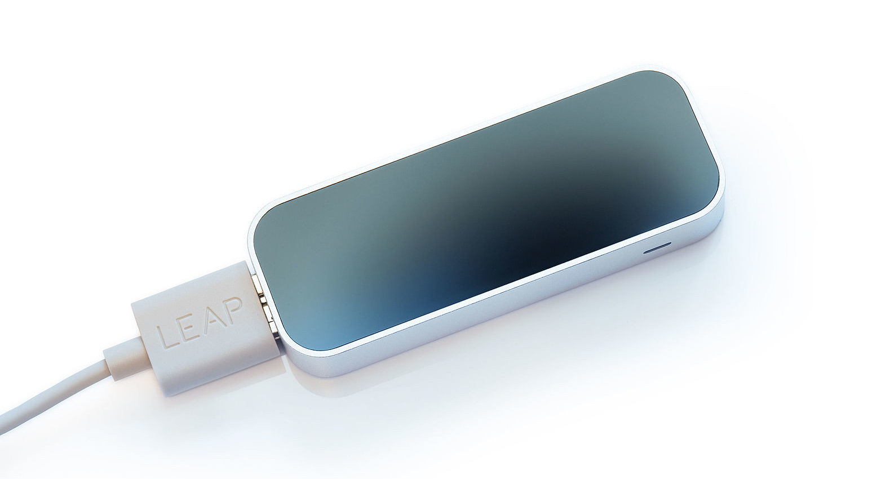
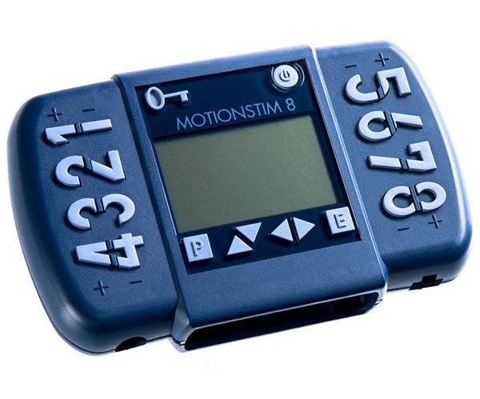

    

[🛠️ Installation](#get-started) |
[📝 Used references](#reference-papers) | 
[💡 Demonstrations](#demonstrations) |
[👨‍💻 Authors](AUTHORS)

# Description of the project
Grasp It is a Python-based software system designed to induce hand movements—specifically grasping—through Functional Electrical Stimulation (FES), without requiring voluntary muscle activation from the user. By applying electrical stimulation to targeted muscles, the system generates predefined movements in the arm.

To ensure accurate and adaptive control, Grasp It incorporates a closed-loop feedback mechanism using an infrared camera. The camera continuously tracks the position and orientation of the hand’s bones, allowing the system to compute joint angles and determine the current state of the grasp. This feedback is compared against a target position, enabling real-time adjustment of the stimulation to achieve or maintain the desired hand posture.

The key innovation lies in this integration of real-time visual tracking with closed-loop stimulation, allowing the system to dynamically compensate for noise, electrode misplacement, individual anatomical differences, or varying skin conditions.

The project is modular, structured into three main nodes:
- **stimulator**: This node receives processed sensor data and delivers precise electrical stimulation through selected electrode channels.
- **sensor**: This node captures and processes data from the infrared camera to calculate joint angles and assess hand posture.
- **commander**: This node listens for verbal cues such as "grasp" or "release" to trigger corresponding hand movements.

These nodes communicate through an MQTT server, which enables a decoupled architecture. This modularity not only enhances code clarity and maintainability but also supports parallel development by multiple contributors.

# Get started
- Install driver for the leap motion controller: `https://leap2.ultraleap.com/downloads/leap-motion-controller/`
- Make sure you have uv package manager installed https://docs.astral.sh/uv/getting-started/installation/
- Download the infrared camera python SDK: `git submodule update --init --recursive`
- Run `uv sync` to install all python packages
- The 3 nodes must be run in parallel
  - Run `uv run src/llsg/sensor/sensor.py` for the **sensor** node responsible to read data from the infrared camera
  - Run `uv run src/llsg/commander/audio.py` for the **commander** node responsible to listen to verbal cues
  - Run `uv run src/llsg/stimulator/stimulator.py` for the **stimulator** node responsible to send the electrical stimulation

# Hardware list

## Leap Motion Controller
Infrared camera sensor with software drivers to detect bones position and orientation in the hand.

## MotionStim 8
FES device (Functional Electrical Stimulation) to trigger and control specific muscle movements by transcutaneous stimulation.

# Reference papers
We used those to learn more about the state of the art closed loop control of eletrical stimulation for hand grasping.
- Ciancibello, J., King, K., Meghrazi, M.A. et al. Closed-loop neuromuscular electrical stimulation using feedforward-feedback control and textile electrodes to regulate grasp force in quadriplegia. Bioelectron Med 5, 19 (2019). https://doi.org/10.1186/s42234-019-0034-y
- C. Lin et al., "Adaptive Closed-Loop Functional Electrical Stimulation System with Visual Feedback for Enhanced Grasping in Neurological Impairments," in IEEE Transactions on Medical Robotics and Bionics, doi: 10.1109/TMRB.2025.3557197. keywords: {Hands;Grasping;Iron;Muscles;Real-time systems;Electrical stimulation;Biomimetics;Monitoring;Medical robotics;Visualization;Neuromuscular Electrical Stimulation;Closed-Loop Control;Visual Perception;Finite State Machine}, 
- Le Guillou, R., Froger, J., Morin, M. et al. Specifications and functional impact of a self-triggered grasp neuroprosthesis developed to restore prehension in hemiparetic post-stroke subjects. BioMed Eng OnLine 23, 129 (2024). https://doi.org/10.1186/s12938-024-01323-y

# Demonstrations
TODO add cool gifs
